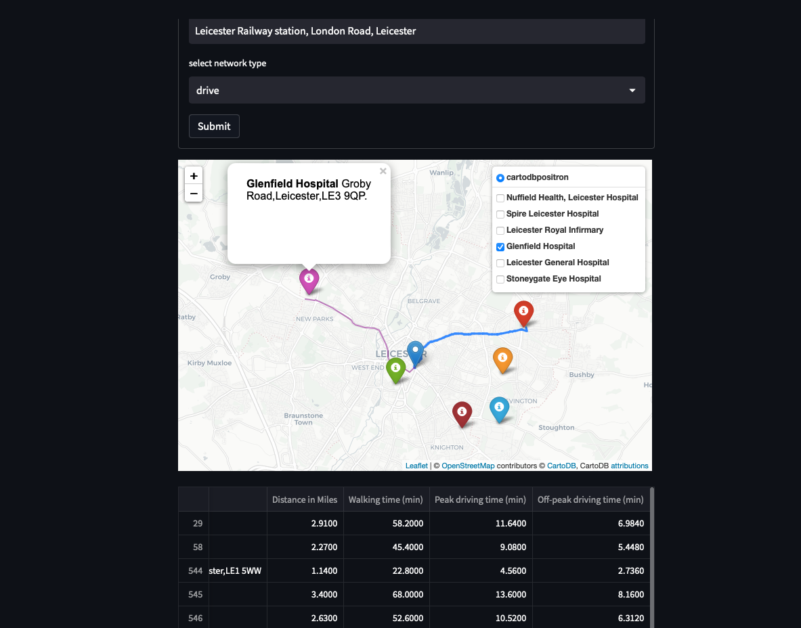
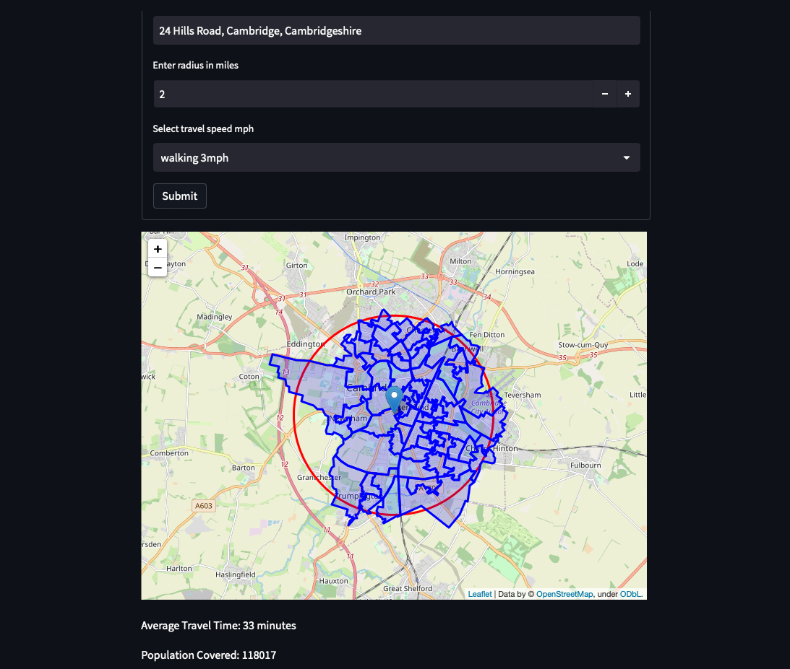

### MedMap - A NHS Geospatial Tool

This was led by [Paul Carroll](https://github.com/pauliecarroll), Senior Data Scientist, at the Digital Analytics & Research Team at NHS England, with a team comprising of 
[Oliver Jones](https://github.com/oliverjonesnhsx), [Muhammed-Faaiz Shawanas](https://github.com/faaiz-25), [Mary Amanuel](https://github.com/maryamanuel1), from NHS England, & 
[Nick Fortescue](https://github.com/nickfortescuegoogle), [Max Morisov](https://github.com/maxim-morosov) engineers at GoogleHealth, without whom this work would not be where it is. 
 
The following [GitHub repository](https://github.com/nhsx/nhs_time_of_travel) contains the initial proof of concept and exploratory analysis for the design of a holistic and interactive 
mapping tool to support decision-making in health and social care. This work was carried out by carried out by [Mattia Ficarelli](https://github.com/mattia-ficarelli), Data Engineer, 
and [Paul Carroll](https://github.com/pauliecarroll).

The work that follows can be seen and downloaded from this repository [GitHub repository](https://github.com/nhs-pycom/nhs_time_of_travel). This is the current piece of work to which the 
following page refers to. Please raise any issues with the code using the issues part of the github repository or contact me directly, paul.carroll9@nhs.net. 

### Use-cases 

Following a presentation at NHS-Pycom on the aforementioned Geospatial work, and several conversations post the presentation, they identified where there are current gaps and needs, 
or use-cases for which a geospatial tool, built specifically for purpose, could help solve the issues they faced. The use-cases they faced were numerous:

- Ambulance drop-offs/ Patient transport
- District Nurse visits
- blood deliveries
- Managing a multi-site portfolio and the transport units within
- Modes and means of transport for NHS staff to their place or places of work, and the environmental impact of their travel
- Carbon reduction and the evidence base for sustainability in order to support external conversations 
- Where to site a new Covid site for maximum population and minimum overlap with other sites
- Where to site a Diabetes or blood test van in order to cut missed appointments for patients by making it easier for them to access services.

### Our Angle -  Cost & Data. Solve these two problems.

The more we spoke to different areas of the NHS the more this need became apparent. What also became apparent was the cost of some of these services. Numerous trusts are paying commercial 
operators for these services. Sometimes these were the only operators out there, as there was nothing publicly available or free. 
But for other services the second need was the need for patient/ staff data to remain confidential, and remain within the trust. Within the NHS data protection is paramount, so taking 
this account, we wanted to build a tool that could be brought to the data. Using open-source software and publicly accessible datasets we wanted to show what is possible and ideally provide this repo as a source for different areas of the NHS to adapt to their own specific needs. There are two publicly available datasets we have used, and these are from NHS Digital. The main software we used is Python 3.10+. The app functionality is Streamlit, with several Geospatial libraries within Python.
This app can be spun up on anyone's laptop, and the data would never need to leave that machine. 

Data sources: [NHS Digital](https://digital.nhs.uk/services/organisation-data-service/file-downloads/gp-and-gp-practice-related-data).

### What our tool does -  Streamlit

Streamlit is an app wrapper, extremely useful and malleable. Especially so when it comes to geospatial work. I carried out some research on Geospatial tools and the best way to approach 
multiple functionalities, and the shining example of this is this page https://github.com/opengeos/streamlit-geospatial. Professor [Qiusheng Wu] https://github.com/giswqs and his 
geospatial page showed us what was possible, and gave us a great example of how to go after certain geospatial tasks, and write the code for how to have these differing geospatial 
functions run together in one app and one place. 

### Three Pages .... so far

### Route Optimisation - aka The Travelling Salesman Problem

To tackle the use-cases of Ambualnce drop-offs/ Patient transport, District Nurse visits, or blood deliveries, it became clear the issue here to solve was one of route optimisation. 
I researched how to go about this online, read several medium articles and also read through several github repositories. In computer science this problem is a NP hard problem, and there 
were no easy solutions out there. There were also quite a few commercial operators in this space, and rightly so, for 10 different addresses, 10 permutations with P(10, 10) gives 3.6 
million approximate outcomes, with 12 addresses this goes up significantly to 479 million. Trying to solve this problem in way that would be computationally relevant for the likely 
laptop power in a NHS trust was a real need here. But also there was a sweetspot. How many patients was a district nurse likely to visit in a day. How many patient drop-offs would there 
be before an ambulance would need to return to hospital, especially in this post covid world. Both of these answers we'd imagine would be less than 12. 
I took the approach of trying to solve the permutations question first, and plotting that route on to a folium map, and measuring it. Using the OSMNX package, in combination with 
[NetworkX](https://networkx.org/documentation/stable/index.html)
and Folium, we were able to achieve this. 

OSMnx is a Python package that lets you download geospatial data from [OpenStreetMap](https://www.openstreetmap.org/) and model, project, visualise and analyse real-world street networks 
and any other geospatial geometries, including walkable, drivable, or bikeable urban networks. A network is a collection of connected objects. The objects in a network are called 
nodes (or vertices) and are visualised as points. The connections between nodes are called edges and are drawn as lines.  OSMnx networks are topologically corrected, directed, 
and preserve one-way directionality. 

Layering the OSMNX and NetworkX nodes and edges onto a Folium map, and using the ox.distance.nearest_nodes and nx.shortest_path functions, we were able to produce a calculation of the 
shortest route around the network. The algorithm we've written does this first for a permutations function, and then for a tsp_greedy function.  
From testing, having the initial permutations distance calculation compare with the tsp_greedy calculation, returned a far more superior output to the route displayed on the folium map. 

The functions are wrapped in the streamlit code, and when the code to run the app is called 'streamlit run streamlit_app.py', this is the page that you'll see when you click on the Route
Optimizer. On the left of the page you have the index, with 'Route Optimizer' highlighted here. The 'hospital.csv' dataset from the data folder is pre-loaded. When you select a town/ City or County from the box, the dataframe will filter to show you all hospitals in the dataset within that area. If you wish to enter a different start address, for example your starting 
address, or a train station, please enter that in the box titled 'Enter a new start address'. When you click on submit, this address will appear in the 'Select start address' field. 
The 'select start address' field is a dropdown box of the filtered dataframe above. 
On the left of the screen just beneath the page index, is a browse files button. This is where you can upload your own data. There is an address_templates.xls file in the templates folder. 
Please use the format in this, 'Name, Address' so the code will pick up your data and geocode it correctly.

  
  &nbsp; &nbsp;

In this example I've selected Leicester, and from the selected addresses, have picked the Nuffield Hospital on Scraptoft Lane. 
Once you hit the submit button the algorithm goes to work, and maybe 20-30 seconds later (could be longer the first time you run this, and if on a larger area for example North Yorkshire or London, both nodes and edge heavy), then you should see the output similar to the following format. The folium map is rendered, and the route plotted. If you hover over a marker, you can see what number that marker is, in this number 1 I've highlighted. The dataframe below the map will show the from and to addresses in the suggested optimised order. If you scroll to the right in the dataframe, distance in miles between each address is there, Total distance, walking time, peak driving time, off peak driving time, and cycling time. These are hard coded and can be edited to your requirements within the code. 

  
  &nbsp; &nbsp;

Please note with the way this algorithm works. This will work well with up to 10, maybe even 12 addresses. But that will depend on the computational power you have available, and it will be slower the higher the number of addresses. Streamlit is set up in our code to cache the Api calls that return a networkx map of a region. So the first you run this on Cornwall, it may
take a while. But the second time and onward, the code will look at the cache first, and call the same json file that was produced for the area if it's there and hasn't been deleted. 
Your data is not cached, only the Nominatim api region calls. 

### Multiple Shortest Route

This is a functionality that was brought by a couple of areas in the NHS. One use case here is suggesting different modes of transport for the shortest route to work for staff, and a future use case could incorporate bus routes, and bus timetables, or public transport routes and timetables. Whilst this function works in a different way from the route optimiser, the premis is the same. The user can again either upload or use the existing datasets in the data folder. Enter a target address, select the network type, press submit and the algorithm will run. 
We envisage this page working when the user inputs their own data, for example addresses for staff, or patients, and runs the algorithm. The algorithm will produce routes to and from each address to the selected target point. 
In the example shown below, I've put the target address as Leicester Railway Station, London Road, Leicester. Again the default here is the hospital.csv dataset, so the hospitals in Leicester are pre-loaded. The functionality visible here is tri-fold. Firstly the map shows you the target, and the markers for each hospital location. If you click on the markers, the details of that marker come up, Leicester Railway Station is shown in this example. Secondly the top right is a route filter, and you can turn the different routes on and off for visibility, shown in the second pic below. 
Thirdly, the dataframe beneath the map show the different routes, distances, and walking, and peak and off-peak driving times in minutes. Here this could be adapted to show bus routes or cycle times. 

  
  &nbsp; &nbsp;

  
  &nbsp; &nbsp;

### Max Coverage Location 

This is the site scoring page. We have tried to take the approach here of providing a concept piece for how this page could work. Retailers use commercial software when it comes to identifying a new location, and take into account local population within a certain distance or time to travel, competitors, substitutes, and a variety of other factors. For our version, we have used time to travel, and population covered from LSOAs. In future, we could add in other hospitals, or gp practices, should the user the require this. 
For now, the user can enter an address, enter the radius in miles around that address, and select the hard coded travel speed. This is weighted per population from the centre of each LSOA. 
Upon hitting submit the user will see a folium map, with a red circumference, and blue highlighted LSOAs, which when you hover over them will display the population of that LSOA. Calculations underneath the map show the average weighted travel time for the population covered, and the total population covered. 

  
  &nbsp; &nbsp;

The two variables that are used here, population, and weighted average time to travel for the selected speed, are shown beneath the map. In this case, 33 minutes, with walking at 3mph selected (this is hard-coded but the speed can be changed), and population covered 118,017.

## Citations

Boeing, G. 2017. [OSMnx: New Methods for Acquiring, Constructing, Analyzing, and Visualizing Complex Street Networks.](https://geoffboeing.com/publications/osmnx-complex-street-networks/)<i>Computers, Environment and Urban Systems</i> 65, 126-139. doi:10.1016/j.compenvurbsys.2017.05.004

## About this page

This page is built using end-to-end open source analytical tools including: [The NHS Digital Service Manual](https://service-manual.nhs.uk/), [python](https://nhs-pycom.net/), [OSMnx](https://osmnx.readthedocs.io/en/stable/), [plotly](https://plotly.com/python/), [folium](http://python-visualization.github.io/folium/), [GeoPy](https://geopy.readthedocs.io/en/stable/), [beautiful soup](https://www.crummy.com/software/BeautifulSoup/), [pandas](https://pandas.pydata.org/docs/), [GeoPandas](https://geopandas.org/en/stable/), [NetworkX](https://networkx.org/documentation/stable/index.html), [geojson](https://python-geojson.readthedocs.io/en/latest/), [github.io](https://pages.github.com/), and [github actions](https://github.com/features/actions).

  <a class="nhsuk-action-link__link" href="https://github.com/nhsx/open-analytics-template">
    <svg class="nhsuk-icon nhsuk-icon__arrow-right-circle" xmlns="http://www.w3.org/2000/svg" viewBox="0 0 24 24" aria-hidden="true">
      <path d="M0 0h24v24H0z" fill="none"></path>
      <path d="M12 2a10 10 0 0 0-9.95 9h11.64L9.74 7.05a1 1 0 0 1 1.41-1.41l5.66 5.65a1 1 0 0 1 0 1.42l-5.66 5.65a1 1 0 0 1-1.41 0 1 1 0 0 1 0-1.41L13.69 13H2.05A10 10 0 1 0 12 2z"></path>
    </svg>
    Find out how to build your own open analytics pipeline
  </a>

